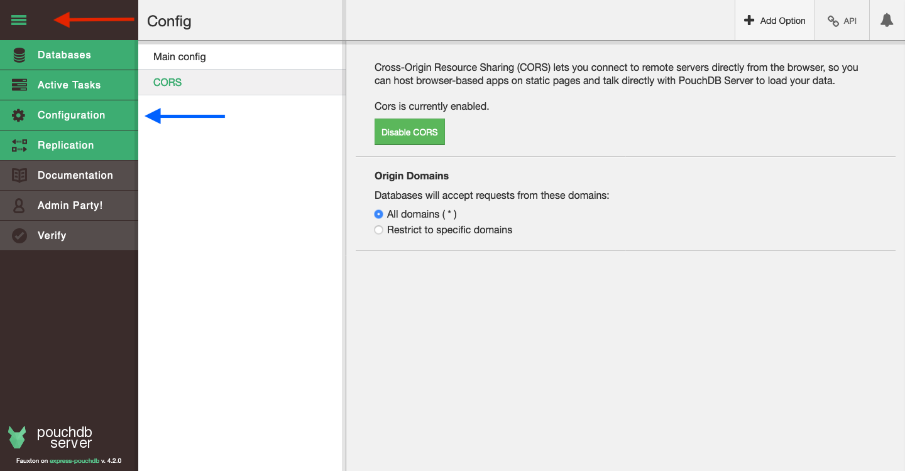

You need to have `node` and `npm` installed. Both are bundled together and can be downloaded at [nodejs.org](https://nodejs.org/).

## Setup Create-React-App

In this tutorial we will be using [Create-React-App](https://create-react-app.dev/). It's fast to start and not opinionated.

Open your terminal and navigate to your development directory. Then enter:

```sh
npx create-react-app use-pouchdb-todo
cd use-pouchdb-todo
npm start
```

This will create a new project with create-react-app installed. `npm start` will start your development server. To visit your app open http://localhost:3000/.

Your app client is in `src/`. When ever you change something, the development server will live reload your app!

## PouchDB and usePouchDB

Next up is **PouchDB**. Lets install **PouchDB** and **usePouchDB**:

<!--DOCUSAURUS_CODE_TABS-->
<!--npm-->

```sh
npm i -D pouchdb-browser use-pouchdb
```

<!--yarn-->

```sh
yarn add -D pouchdb-browser use-pouchdb
```

<!--END_DOCUSAURUS_CODE_TABS-->

There is a PouchDB plugin for the sign up, log in and log out flow: [PouchDB Authentication](https://github.com/pouchdb-community/pouchdb-authentication).

<!--DOCUSAURUS_CODE_TABS-->
<!--npm-->

```sh
npm i -D pouchdb-authentication
```

<!--yarn-->

```sh
yarn add -D pouchdb-authentication
```

<!--END_DOCUSAURUS_CODE_TABS-->

## CouchDB backend

Now which to use? **CouchDB** or **PouchDB-Server**? Well, normally both. PouchDB-Server is local to the project. It is installable with **npm**, you can define where it should store its data. While CouchDB is the one you will be using in production. It is more powerful. So I normally recommend that you install both. PouchDB-Server for your development. And CouchDB to verify and test if everything works. But to only get started, PouchDB-Server is enough. And that is why we are going to be using PouchDB-Server for this guide.

There are some incompatibilities though.

While PouchDB-Server is intended as a drop-in replacement of CouchDB, the later moves faster. At the time of writing, <time datetime="2020-05-23">2020-05-23</time>, CouchDB did release [version 3](https://docs.couchdb.org/en/3.1.0/whatsnew/3.0.html) and PouchDB-Server didn't catchup yet.

Regarding compatibility the biggest change was, that the default setup of CouchDB _is more secure_. In previous versions in the standard setup, everyone could create an user. Now you must be an admin or change some settings.

Now, CouchDB lacks some user management features; for example sending Mails to the user, or resetting a password. You need to implement them yourself. With [serverless functions (function as a service)](https://en.wikipedia.org/wiki/Function_as_a_service) it became more strate forward. But you won't be able to use every method of [**PouchDB Authentication**](https://github.com/pouchdb-community/pouchdb-authentication/blob/master/docs/api.md#dbsignupusername-password--options--callback). Log in/out still works though.

In this tutorial we will be using the old sign up method, where everyone can create an account and no verification mail is send. If in your app you need more, please visit [CouchDBs Security section](https://docs.couchdb.org/en/stable/intro/security.html).

> You don't need CouchDB installed for this tutorial!
>
> Because you have to change some security settings, it might be better to _only_ use PouchDB-Server for the beginning. And when you are more comfortable with PouchDB and its distributed nature, learn more about Apache CouchDB.

### Installing PouchDB Server

[PouchDB-Server](https://www.npmjs.com/package/pouchdb-server) can be found on `npm`.

<!--DOCUSAURUS_CODE_TABS-->
<!--npm-->

```sh
npm i -D pouchdb-server
```

<!--yarn-->

```sh
yarn add -D pouchdb-server
```

<!--END_DOCUSAURUS_CODE_TABS-->

To start enter:

```sh
npx pouchdb-server
```

All options can be found in [the README](https://github.com/pouchdb/pouchdb-server#readme).

Now it would be good if we could start the create-react-app dev-server and pouchdb-server with only one command!
<br />First install [npm-run-all](https://www.npmjs.com/package/npm-run-all). It allows us to run multiple commands in parallel or sequential.

<!--DOCUSAURUS_CODE_TABS-->
<!--npm-->

```sh
npm i -D npm-run-all
```

<!--yarn-->

```sh
yarn add -D npm-run-all
```

<!--END_DOCUSAURUS_CODE_TABS-->

Now open `package.json` and change your scripts:

```json
{
  "scripts": {
    "start": "npm-run-all --parallel start:*",
    "start:pouch": "pouchdb-server --dir db",
    "start:cra": "react-scripts start",
    "build": "react-scripts build",
    "test": "react-scripts test",
    "eject": "react-scripts eject"
  }
}
```

The `pouchdb-server --dir db` command configures pouchdb-server to store all databases in the `./db/` directory ([more here](https://github.com/pouchdb/pouchdb-server#full-options)).

Now with `npm start` or `yarn start` both you dev-server and pouchdb-server will start! To start just one enter:

<!--DOCUSAURUS_CODE_TABS-->
<!--npm-->

```sh
# to only start pouchdb-server
npm run start:pouch
# or to only start react-scripts
npm run start:cra
```

<!--yarn-->

```sh
# to only start pouchdb-server
yarn run start:pouch
# or to only start react-scripts
yarn run start:cra
```

<!--END_DOCUSAURUS_CODE_TABS-->

#### CORS

Next up [CORS](https://en.wikipedia.org/wiki/Cross-origin_resource_sharing)! We will create an app that is going to be served from one server, while connecting to PouchDB-Server/CouchDB on another domain. That's why CORS must be enabled.

##### Using add-cors-to-couchdb

There is the npm tool [`add-cors-to-couchdb`](https://github.com/pouchdb/add-cors-to-couchdb), it auto configs CORS for you, to allow you to access CouchDB/PouchDB-Server from every domain.

```sh
npx add-cors-to-couchdb http://127.0.0.1:5984 -u myusername -p mypassword
```

Username and password is not required for PouchDB-Server, if you didn't setup an admin.

##### Manually setting CORS

First open Fauxton on http://127.0.0.1:5984/_utils/. Fauxton is the web-interface of both PouchDB-Server and CouchDB.



You can expend the sidebar with the hamburger menu at the top.

Then open **Configuration**. In it select **CORS**. And enable CORS. You can allow _All domains_ or restrict it to http://localhost:3000/ (standard create-react-app port).

In your project directory should now be a `config.json`, with a content similar to this (but a different uuid):

```json
{
  "couchdb": {
    "uuid": "28a7ec02-b524-4716-950d-4549c4adedc1"
  },
  "httpd": {
    "enable_cors": true
  },
  "cors": {
    "origins": "*",
    "credentials": true,
    "headers": "accept, authorization, content-type, origin, referer",
    "methods": "GET, PUT, POST, HEAD, DELETE"
  }
}
```

You can also configure PouchDB-Server using `config.json`. `couchdb.uuid` will be different. `httpd.enable_cors` and `cors` might be missing, but if in Fauxton there was `Cors is currently enabled.`, then everything is setup correctly.

We are now all set!
